# Modern Todo App

A beautifully designed, responsive, and feature‑rich Todo application to boost your productivity.

## Live Demo

[View Live](https://storage.googleapis.com/modern-todo-kartik/landing.html)

*This site is hosted publicly on **Google Cloud Platform (GCP)** using **Cloud Storage**.*

---

## Project Structure

* `landing.html` — A stunning, animated landing page with feature highlights and pricing cards.
* `index.html` — The core Todo application with theme toggling, Firebase authentication, and Firestore integration.

---

## Project Architecture




---

## Features

### Landing Page

* Hero section with a strong call-to-action
* Animated scroll effects for features
* Fully responsive layout
* Built using HTML, CSS, and Vanilla JavaScript

### Todo App

* Secure sign-in with **Google** and **Email/Password** (via Firebase Auth)
* Create, edit, delete tasks per user
* Data stored in **Cloud Firestore** at `users/{uid}/todos`
* Smooth dark/light mode toggle
* Realtime syncing with Firestore
* UI animations for better user experience

---

## Cloud Services Used

This project leverages **four cloud services** from Google Cloud and Firebase to build a scalable, serverless, and modern web application:

### 1. **Cloud Storage (GCP)**

* **Purpose**: Hosts static frontend files like HTML, CSS, and JS.
* **Bucket Name**: `modern-todo-kartik`
* **Access**: Public (used to serve the landing and app pages)
* **Live URL**: [https://storage.googleapis.com/modern-todo-kartik/landing.html](https://storage.googleapis.com/modern-todo-kartik/landing.html)
* **Highlights**: Eliminates the need for a web server. Static hosting is fast, reliable, and cost-efficient.

---

### 2. **Firebase Authentication**

* **Purpose**: Handles user authentication securely.
* **Providers Enabled**:

  * Google Sign-In
  * Email and Password
* **How It Works**:

  * Each user logs in and gets a unique UID.
  * That UID is used to fetch/store todos from Firestore.
* **Security**: Tokens managed by Firebase ensure only authenticated access to user data.

---

### 3. **Cloud Firestore (Firebase)**

* **Purpose**: Stores each user’s todos in a structured, NoSQL database.
* **Data Path**: `users/{uid}/todos/{todoId}`
* **Features**:

  * Real-time sync between frontend and database
  * Offline persistence
  * Per-user data isolation
* **Security Rules**:

  ```js
  match /users/{userId}/todos/{todoId} {
    allow read, write: if request.auth.uid == userId;
  }
  ```

---

### 4. **Cloud Functions (GCP)**

* **Runtime**: Node.js 16
* **Number of Functions**: 3 active functions
* **Used For**:

  * Sending welcome email on sign-up
  * Logging user activity
  * Validating or formatting todo data before saving
* **Trigger Types**:

  * HTTP-triggered functions
  * Firestore `onCreate` and `onDelete` triggers
* **Why It Matters**: Allows complex logic to run securely on the backend without exposing it to the frontend.

---

## Tech Stack

* HTML5
* CSS3
* Vanilla JavaScript (ES6)
* Firebase Auth & Firestore
* Cloud Functions (Node.js 16)
* FontAwesome for icons
* Inter font from Google Fonts

---

## Setup Locally

```bash
git clone https://github.com/kartikbudarap/CDAC_ModernTodo.git
cd modern-todo-app
# Open index.html directly or run a Live Server (like the VS Code extension)
```

---

## Deployment Notes

* Static files are deployed to a GCP Cloud Storage bucket (`modern-todo-kartik`)
* Firebase is used for Auth and Firestore
* Cloud Functions deployed using Firebase CLI
* All configurations follow best practices for security and scalability

